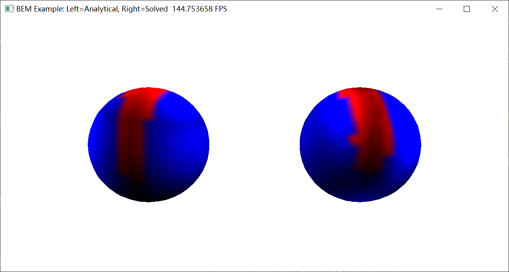

# Taichi-BEM

## --------Analytical (Left) ---------Solved (Right)--------

### Laplace Equation


### Helmholtz Equation



### How to run the code

```bash
cd taichi-BEM
pip install -r requirements.txt
cd demo
python demo_3d_Laplace.py --boundary Dirichlet
```


### Trouble Shooting