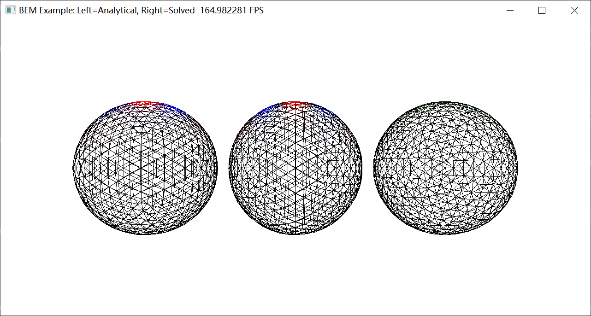

# Taichi-BEM

### ----------Analytical(Left)----Solved(Middle)----Difference(Right)

### Laplace Equation (2D)


### Laplace Equation (3D)


### Helmholtz Equation (3D)


### Helmholtz Transmission Equation


### Norm analysis (Still Working on! 👨‍💻)
* The sample step of wave number is 1/30, which implies for wavenumbers between [16, 18], 60 points are sampled.
* Precious matters, float64 shows more stability than float32 for operator AI (Somehow not very obvious for operator AII).

### The norm of A (Left) and Augmented A (Right)

 

 

### How to run the code

```bash
cd taichi-BEM
conda create -n ti-BEM python=3.8
conda activate ti-BEM
conda install pytorch torchvision torchaudio pytorch-cuda=11.6 -c pytorch -c nvidia
pip install -r requirements.txt

cd demo
python demo_Laplace.py --boundary Dirichlet --dim 3
python demo_Helmholtz.py --boundary Neumann --k 3 --dim 3 --object stanford_bunny
python demo_Helmholtz_Transmission.py --boundary Full --k 5 --dim 3
```

### Parameters
- boundary := [‘Dirichlet’, 'Neumann', 'Mix']
  - Dirichlet: If You want to set Dirichlet boundary and solve Neumann charges, pick this.
  - Neumann: If You want to set Neumann boundary and solve Dirichlet charges, pick this.
  - Mix: If You want to set Dirichlet boundary and solve Neumann charges for y > 0, and otherwise for y <= 0, pick this. If you want to self define your design of Dirichlet region and Neumann region, go to file [mesh_manager.py](src/managers/mesh_manager.py) and reach function [set_mixed_bvp](src/managers/mesh_manager.py), you might handle it with your own preference.
  - Full: This is only useful for Transmission problem, Both Neumann/Dirichlet boundary will be applied, and the corresponding boundary will be solved for interior.
- kernel := ['Laplace', 'Helmholtz']
  - Laplace: Solve Laplace equation
  - Helmholtz: Solve Helmholtz equation
- object := ['sphere', 'cube']
  - sphere: an obj file will be read into our scope by [sphere.obj](assets/sphere.obj)
  - You can add your own .obj files into [/assets](assets/) directory and use the obj file name as your own mesh object
- show_wireframe := [True, False]
  - This parameter defines if wireframe is shown in final GUI


### Trouble Shooting